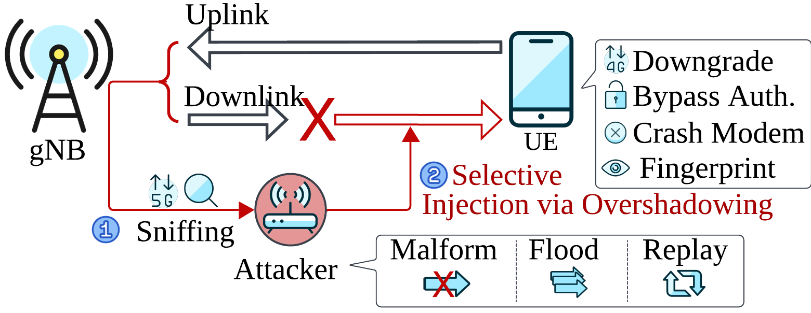
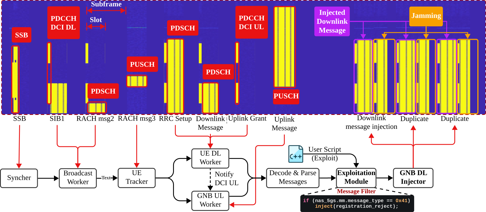
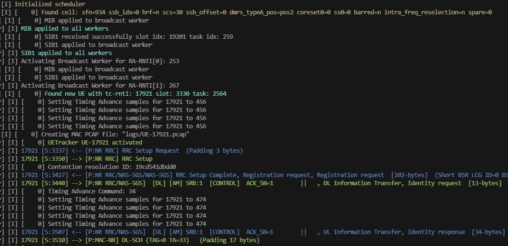
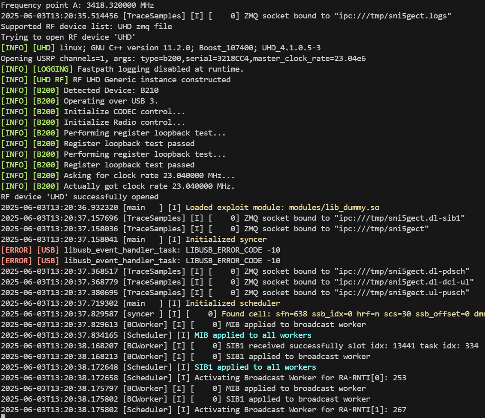
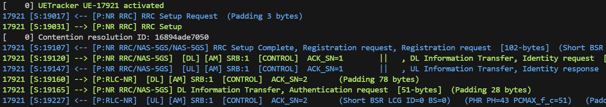
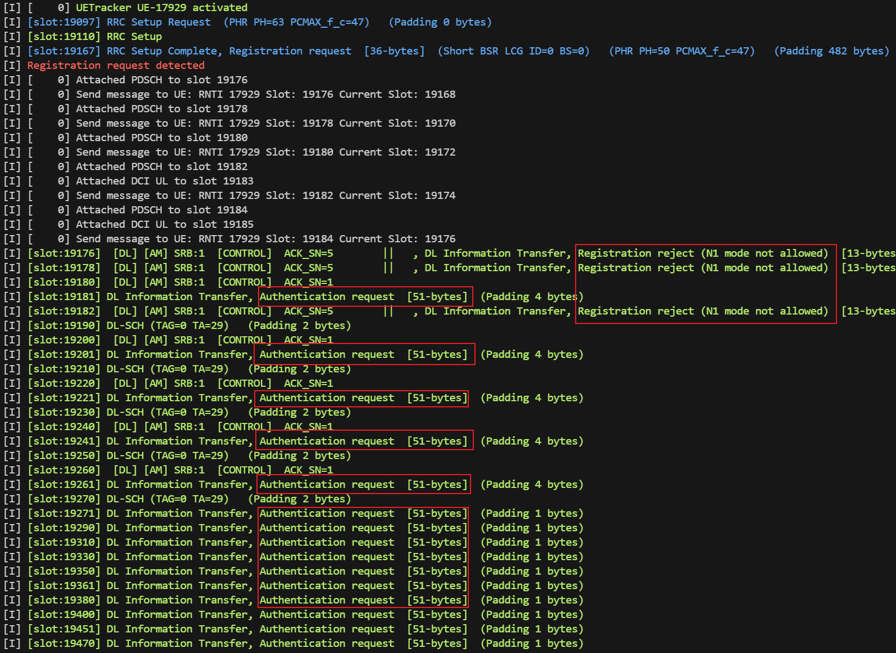
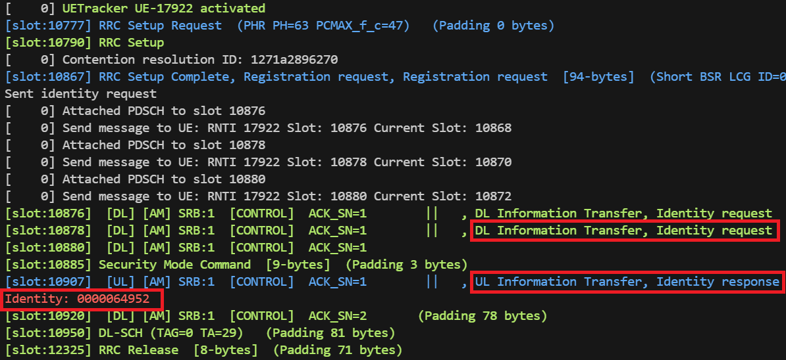
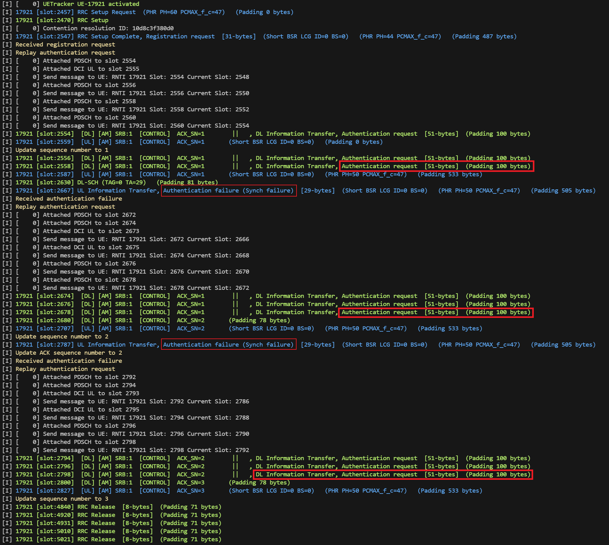
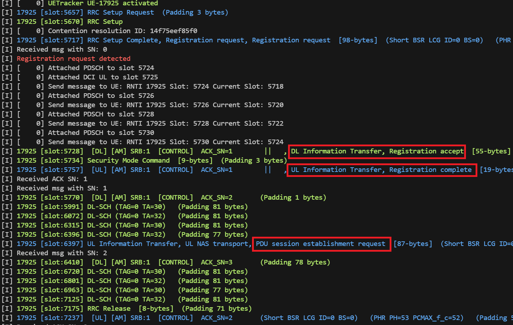

<a href="https://nicegui.io/#about">
  
</a>

# Sni5Gect - Framework for 5G NR Sniffing and Exploitation

Sni5Gect (Sniffing 5G Inject) is a framework designed to sniff unencrypted messages send between the base station and the UE, and inject messages to target User Equipment (UE) over-the-air at specific states of 5G NR communication. This can be used to carry out attacks such as crashing the UE modem, downgrading to earlier generations of networks, fingerprinting, or authentication bypass.

The framework has been evaluated with five commercial off-the-shelf (COTS) UE devices, including smartphones and USB modems. It has also been tested with [srsRAN](https://github.com/srsran/srsRAN_Project) and [Effnet](https://www.effnet.com/products/protocolstack-nw/) as legitimate 5G base stations.



Sni5Gect artifacts paper received the following badges in the 34th USENIX Security Symposium. Artifacts pdf available at [docs/_media](https://github.com/asset-group/Sni5Gect-5GNR-sniffing-and-exploitation/blob/77e996b3b2aca6cc3f3fb6ccf3812f19a6490564/docs/_media/USENIX_Security__25_Artifact_Appendix__SNI5GECT__A_Practical_Approach_to_Inject_aNRchy_into_5G_NR.pdf).

<div style="text-align: center;">
  
  
  
</div>


---
## Table of Contents
- [Overview of Components](#overview-of-components)
- [Project Structure](#project-structure)
- [Features Supported](#features-supported)
- [Requirements](#requirements)
    - [Hardware Requirements](#hardware-requirements)
    - [Software Requirements](#software-requirements)
    - [Evaluated Devices](#evaluated-devices)
- [Getting Started (Docker)](#getting-started-docker)
- [Example Configuration](#example-configuration)
- [Running Sni5Gect](#running-sni5gect)
- [Exploit Modules](#exploit-modules)
    - [Sniffing: Dummy](#sniffing-dummy)
        - [DCI Sniffing](#dci-sniffing)
    - [Crash: 5Ghoul Attacks](#crash5ghoulattacks)
    - [Downgrade: Registration Reject](#downgrade-registration-reject)
    - [Fingerprinting: Identity Request](#fingerprinting-identity-request)
    - [Downgrade: Authentication Replay](#downgrade-authentication-replay)
    - [Authentication Bypass: Registration Accept 5G AKA bypass](#authentication-bypass-5g-aka-bypass)
- [Disclaimer](#disclaimer)
- [Citing Sni5Gect](#citing-sni5gect)

## Overview of Components
Sni5Gect comprises of several components, each responsible for handling different signals:
- Syncher: Synchronizes time and frequency with the target base station.
- Broadcast Worker: Decodes broadcast information such as SIB1 and detects and decodes RAR.
- UETracker: Tracks the connection between the UE and the base station.
- UE DL Worker: Decodes messages sent from the base station to the UE.
- GNB UL Worker: Decodes messages sent from the UE to the base station.
- GNB DL Injector: Encodes and sends messages to the UE.



## Project Structure
The project is organized as follows. The core Sni5Gect framework resides in the `shadower` directory. Key components are implemented in the following files:
```
.
├── cmake
├── configs
├── credentials
├── debian
├── images
├── lib
├── shadower
│   ├── hdr
│   ├── modules
│   ├── src
│   │   ├── broadcast_worker.cc # Broadcast Worker implementation
│   │   ├── gnb_dl_worker.cc    # GNB DL Injector implementation
│   │   ├── gnb_ul_worker.cc    # GNB UL Worker implementation
│   │   ├── scheduler.cc        # Distributes received subframes to components
│   │   ├── syncer.cc           # Syncher implementation
│   │   ├── ue_dl_worker.cc     # UE DL Worker implementation
│   │   ├── ue_tracker.cc       # UE Tracker implementation
│   │   └── wd_worker.cc        # wDissector wrapper
│   ├── test
│   └── tools
├── srsenb
├── srsepc
├── srsgnb
├── srsue
├── test
└── utils
```
## Features Supported
We have tested with the following configurations:
- Frequency Bands: n78, n41 (TDD)
- Frequency: 3427.5 MHz, 2550.15 MHz
- Subcarrier Spacing: 30 kHz
- Bandwidth: 20–50 MHz
- MIMO Configuration: Single-input single-output (SISO)
- Distance: 0 meter to upto 20 meters (with amplifier)

An example srsRAN base station configuration is available at `configs/srsran-n78.yml`.

## Requirements

### Hardware Requirements
Sni5Gect utilizes a USRP Software Defined Radio (SDR) device to send and receive IQ samples during communication between a legitimate 5G base station and a UE. Following SDRs are supported:
- USRP B210 SDR
- USRP x310 SDR

Host Machine Recommendations:
- Minimum: 12-core CPU
- 16 GB RAM

Our setup consists of AMD 5950x processor with 32 GB memory.

### Software Requirements
- Operating System: Ubuntu 22.04 (containerized environment)
- Note: The host should be dedicated to Sni5Gect without resource-intensive applications (e.g., GUI) to prevent SDR overflows.

#### Sni5Gect leverages the following software components:
- [wDissector](https://github.com/asset-group/5ghoul-5g-nr-attacks) for analyzing over-the-air traffic.
- [Wireshark display filters](https://www.wireshark.org/docs/dfref/) to identify communication states.

Sni5Gect builds upon [srsRAN 4G](https://github.com/srsran/srsRAN_4G) utilizing features such as SSB search, PBCH decoding, PDCCH decoding, PDSCH encoding/decoding, and PUSCH decoding.

### Evaluated Devices
The following COTS devices are evaluated:

|Model|Modem|Patch Version|
|-----|-----|-------------|
|OnePlus Nord CE 2 IV2201|MediaTek MT6877V/ZA|2023-05-05|
|Samsung Galaxy S22 SM-S901E/DS|Snapdragon X65|2024-06-01|
|Google Pixel 7 |Exynos 5300|2023-05-05|
|Huawei P40 Pro ELS-NX9|Balong 5000|2024-02-01|
|Fibocom FM150-AE USB modem|Snapdragon X55|NA|

## Getting Started (Docker)
We recommend running the entire stack within an Ubuntu 22.04 Docker container to ensure consistent dependencies and avoid affecting the local environment.

Build and Start the Docker Container:
```bash
docker compose build
docker compose up -d
```

Access the Container:
```bash
docker exec -it artifacts bash
```

## Example Configuration
An example configuration is provided in `configs/config-srsran-n78-20MHz.conf`
```conf
[cell]
band = 78       # 5G Band number used
nof_prb = 51    # Number of Physical Resource Blocks, obtained from srsRAN base station
scs_common = 30 # Subcarrier Spacing for common (kHz)
scs_ssb = 30    # Subcarrier Spacing for SSB (kHz)

[rf]
freq_offset = 0        # Frequency offset (Hz)
tx_gain = 80           # Transmit gain (dB)
rx_gain = 40           # Receive gain (dB)
dl_arfcn = 628500      # Downlink ARFCN
ssb_arfcn = 628128     # SSB ARFCN
sample_rate = 23.04e6  # Sample rate (Hz)
uplink_cfo_correction = -0.00054  # Uplink CFO (Hz) correction

[recorder]
enable_recorder = false # Enable recording the IQ samples to a file
recorder_file = /tmp/output.fc32 # Recording output file

[task]
slots_to_delay = 5         # Number of slots to delay injecting the message
max_flooding_epoch = 4     # Number of duplications to send in each inject
tx_cfo_correction = 0      # Uplink CFO correction (Hz)
send_advance_samples = 160 # Number of samples to send in advance
n_ue_dl_worker = 4         # Number of UE downlink workers
n_ue_ul_worker = 4         # Number of UE uplink workers
n_gnb_dl_worker = 4        # Number of gNB downlink workers
n_gnb_ul_worker = 4        # Number of gNB uplink workers
pdsch_mcs = 3              # PDSCH MCS for injection
pdsch_prbs = 24            # PDSCH PRBs for injection
close_timeout = 5000       # Close timeout, after how long haven't received a message should stop tracking the UE (ms)


[source]
source_type = uhd # Source type: file, uhd
source_module = build/shadower/libuhd_source.so
source_params = type=b200,serial=3218CC4  # Device arguments for SDR source

[log]
log_level = INFO           # General log level
syncer_log_level = INFO    # Syncer log level
worker_log_level = INFO    # Worker log level: Set to DEBUG to observe the DCI information
bc_worker_log_level = INFO # Broadcast worker log level

[pcap]
pcap_folder = logs/ # Pcap folder

[worker]
pool_size = 20 # Worker pool size
num_ues = 12   # Number of UETrackers to pre-initialize
enable_gpu_acceleration = false


[exploit]
module = modules/lib_dummy.so # Note only one exploit module can be loaded each time
```

## Running Sni5Gect
The Sni5Gect executable is located in the `build/shadower` directory, and configuration files are available in the `configs` folder.

### Running with Example Connection Recording
The easiest way to get started with Sni5Gect is to run it using a pre-recorded IQ sample file. We've provided a sample for offline testing.

1. Download and Extract the example recording file from Zenodo:
```bash
wget https://zenodo.org/records/15601773/files/example-connection-samsung-srsran.zip
unzip example-connection-samsung-srsran.zip
```
2. Edit `configs/config-srsran-n78-20MHz.conf` and modify the `[source]` section as follows:

```bash
[source]
source_type = file
source_module = build/shadower/libfile_source.so
# Replace with the absolute path to the extracted IQ sample file if needed
source_params = /root/sni5gect/example_connection/example.fc32  
```

3. Finally launch the sniffer using:
```bash
./build/shadower/shadower configs/config-srsran-n78-20MHz.conf
```
You should see output similar to the screenshot below:


### Running with an SDR (Live Sniffing)
To test Sni5Gect with a live over-the-air signal using a Software Defined Radio (SDR), update the configuration file to use the SDR as the source.

Example `[source]` Section for UHD-compatible SDR (e.g., USRP B200)
```bash
[source]
source_type = uhd
source_module = build/shadower/libuhd_source.so
source_params = type=b200
```

Then start the sniffer with:
```bash
./build/shadower/shadower configs/config-srsran-n78-20MHz.conf
```
Upon startup, Sni5Gect will do the following:

1. Search for the base station using the specified center and SSB frequencies.
2. Retrieve cell configuration from SIB1.
3. Detect RAR messages indicating a new UE connecting to the target base station.


## Exploit Modules
The exploit modules are designed to provide a flexible way to load different attack or exploits. When receiving a message, it will first send to wDissector to analyze the packet and if the packet matches with any [Wireshark display filters](https://www.wireshark.org/docs/dfref/) specified, it will react according to the `post_dissection` specified, either inject messages to the communication or extract certain fields.

### Sniffing: Dummy
This module performs passive sniffing. The wDissector framework dissects packets and provides summaries of received packets.
```conf
module = modules/lib_dummy.so 
```
Example output:


#### DCI Sniffing
To monitor decoded DCI (Downlink Control Information) messages in real time, set the following logging configuration:
```conf
worker_log_level = DEBUG
```
With this setting, the sniffer logs detailed DCI-related information, including:
- DCI UL (Uplink Scheduling)
- PUSCH decoding results
- DCI DL (Downlink Scheduling)
- PDSCH decoding results

Example output: 

```bash
[D] [    0] DCI UL slot 6732 17503: c-rnti=0x4601 dci=0_0 ss=common0 L=2 cce=0 f_alloc=0x498 t_alloc=0x0 hop=n mcs=9 ndi=1 rv=0 harq_id=0 tpc=1 
[D] [    0] PUSCH 6734 17507: c-rnti=0x4601 prb=(3,26) symb=(0,13) CW0: mod=QPSK tbs=528 R=0.670 rv=0 CRC=OK iter=1.0 evm=0.04 t_us=249 epre=+16.6 snr=+24.0 cfo=-2657.6 delay=-0.0 
[I] 17921 [S:17507] <-- [P:NR RRC/NAS-5GS/NAS-5GS] RRC Setup Complete, Registration request, Registration request  [113-bytes] (Padding 405 bytes) 
[D] [    0] DCI DL slot 6741 17520: c-rnti=0x4601 dci=1_1 ss=ue L=1 cce=4 f_alloc=0x14 t_alloc=0x0 mcs=20 ndi=0 rv=0 harq_id=0 dai=0 tpc=1 harq_feedback=3 ports=0 srs_request=0 dmrs_id=0 
[D] [    0] PDSCH 6741 17520: c-rnti=0x4601 prb=(20,20) symb=(2,13) CW0: mod=64QAM tbs=54 R=0.593 rv=0 CRC=OK iter=1.0 evm=0.00 epre=+11.2 snr=+39.5 cfo=-0.7 delay=-0.0 
[I] 17921 [S:17520] --> [P:NR RRC/NAS-5GS] DL Information Transfer, Identity request  [13-bytes]  (Padding 31 bytes) 
```


### Crash: 5Ghoul Attacks
These exploits are taken from paper [5Ghoul: Unleashing Chaos on 5G Edge Devices](https://asset-group.github.io/disclosures/5ghoul/). These affect the MTK modems of the OnePlus Nord CE2. 
|CVE|Module|
|---|------|
|CVE-2023-20702|lib_mac_sch_rrc_setup_crash_var.so|
|CVE-2023-32843|lib_mac_sch_mtk_rrc_setup_crash_3.so|
|CVE-2023-32842|lib_mac_sch_mtk_rrc_setup_crash_4.so|
|CVE-2024-20003|lib_mac_sch_mtk_rrc_setup_crash_6.so|
|CVE-2023-32845|lib_mac_sch_mtk_rrc_setup_crash_7.so|

Upon receiving the `RRC Setup Request` message from the UE, Sni5Gect replies with malformed `RRC Setup` to the target UE. If the UE accepts such malformed `RRC Setup` message, it crashes immediately, this can be confirmed from the adb log containing keyword `sModemReason`, which indicates the MTK modem crashes. For example:
```
MDMKernelUeventObserver: sModemEvent: modem_failure
MDMKernelUeventObserver: sModemReason:fid:1567346682;cause:[ASSERT] file:mcu/l1/nl1/internal/md97/src/rfd/nr_rfd_configdatabase.c line:4380 p1:0x00000001
```


### Downgrade: Registration Reject
Utilizes the TC11 attack from the paper [Never Let Me Down Again: Bidding-Down Attacks and Mitigations in 5G and 4G](https://dl.acm.org/doi/10.1145/3558482.3581774).  Injects a `Registration Reject` message after receiving a `Registration Request` from the UE, causing it to disconnect from 5G and downgrade to 4G. Since the base station may not be aware of the disconnection, it may keep sending the messages such as `Security Mode Command`, `Identity Request`, `Authentication Request`, etc.

```conf
module = modules/lib_dg_registration_reject.so 
```
Example Output:



### Fingerprinting: Identity Request
Demonstrates a fingerprinting attack by injecting an `Identity Request` message after receiving a `Registration Request`. If the UE accepts, it responds with an `Identity Response` containing its SUCI information.

```conf
module = modules/lib_identity_request.so 
```
Example output:


### Downgrade: Authentication Replay
This exploit corresponds to `CVD-2024-0096`. It is the most complex exploit we have, which involves two stages, sniffing and replaying. Then during the relaying stage, it requires sniffing and injecting at multiple different states.

1. Sniffing: Capture a legitimate Authentication Request from the base station to the UE.
```conf
module = modules/lib_dg_authentication_request_sniffer.so 
```

2. Replaying: Update `shadower/modules/dg_authentication_replay.cc` with the captured MAC-NR values. Rebuild the module:
```bash
ninja -C build
```

Then load the module:
```conf
module = modules/lib_dg_authentication_replay.so
```

Upon receiving `Registration Request` from the UE, Sni5Gect replays the captured `Authentication Request` message to the target UE. Upon receiving the replayed `Authentication Request` message, the UE replies with `Authentication Failure` message with cause `Synch Failure` and starts the timer T3520. Then Sni5Gect update its RLC and PDCP sequence number accordingly and replays the `Authentication Request` message for a few more times. Eventually, after multiple attempts and timer T3520 expires, the UE deems that the network has failed the authentication check. Then it locally releases the communication and treats the active cell as barred. If no other 5G base station is available, then the UE will downgrade to 4G and persists in downgrade status up to 300 seconds according to the specification 3GPP TS 24.501 version 16.5.1 Release 16 `5.4.1.2.4.5 Abnormal cases in the UE`. (Some phone may stay in downgrade status for much longer time).

In the example output, we can identify the UE replies the `Authentication Failure` message two times in the following screenshot.



### Authentication Bypass: 5G AKA Bypass
This exploit is utilizing $I_8$ 5G AKA Bypass from paper [Logic Gone Astray: A Security Analysis Framework for the Control Plane Protocols of 5G Basebands](https://www.usenix.org/conference/usenixsecurity24/presentation/tu). Only the Pixel 7 phone with Exynos modem is being affected.
After receiving `Registation Request` from the UE, Sni5Gect injects the plaintext `Registration Accept` message with security header 4. The UE will ignore the wrong MAC and accept the `Registration Accpet` message, reply with `Registration Complete` and `PDU Session Establishment Requests`. Since the core network receives such unexpected messages, it instruct the gNB to release the connection by sending the `RRC Release` message to terminate the connection immediately.
```conf
module = modules/lib_plaintext_registration_accept.so
```
Example output:


## Disclaimer
This framework is for research and educational purposes only. Unauthorized use of Sni5Gect on live public networks or devices without consent may violate local laws and regulations.
The authors and contributors are not responsible for any misuse.

## Citing Sni5Gect
```
@inproceedings{
  author={Shijie Luo and Garbelini Matheus E and Chattopadhyay Sudipta and Jianying Zhou},
  booktitle={34th USENIX Security Symposium (USENIX Security 25)},
  title={Sni5Gect: A Practical Approach to Inject aNRchy into 5G NR}, 
  year={2025},
}
