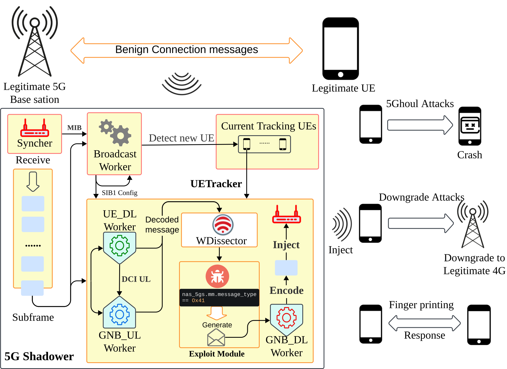

Sni5Gect: A Practical Approach to Inject aNRchy into 5G NR
======

Sni5Gect (Sniffing 5G Inject) is a framework designed to sniff and inject messages into target User Equipment (UE) over-the-air at specific stages of 5G NR communication.

The framework has been evaluated with five commercial off-the-shelf (COTS) UE devices, including smartphones and USB modems. It has also been tested with [srsRAN](https://github.com/srsran/srsRAN_Project) and [Effnet](https://www.effnet.com/products/protocolstack-nw/) as legitimate 5G base stations.

Below is an overview of the framework:



Different signals decoded by different components of the framework:


This repository contains the implementation of Sni5Gect, which is modified from [srsRAN 4G](https://github.com/srsran/srsRAN_4G).

---
## Table of Contents
- [Requirements](#requirements)
    - [Hardware](#hardware)
    - [Software](#software)
- [Setup](#setup)
- [Configuration](#configuration)

## Requirements
### Hardware
The Sni5Gect framework uses a Software Defined Radio (SDR) device to send and receive IQ samples during communication between a legitimate 5G base station and a UE.

Tested configuration:
- Frequency band: n78 (TDD)
- Subcarrier spacing: 30 kHz
- Bandwidth: 20 MHz

An example srsRAN base station configuration can be found in configs/srsran-n78.yml

For host machine, we recommend using machine with at least 8 cores, 16 GB memory, our setup consists of AMD 5950x processor with 32 GB memory.

### Software
Sni5Gect leverages [wDissector](https://github.com/asset-group/5ghoul-5g-nr-attacks) for analyzing over-the-air traffic and utilizes [Wireshark display filters](https://www.wireshark.org/docs/dfref/) to identify communication states.

The framework builds upon [srsRAN 4G](https://github.com/srsran/srsRAN_4G) and uses its encoding and decoding features.

We recommend running the whole stack in the Ubuntu 22.04 docker container on Debian host. 

## Setup
1. Setup [wDissector](https://github.com/asset-group/5ghoul-5g-nr-attacks) by follow the [requirements.sh script](https://github.com/asset-group/5ghoul-5g-nr-attacks/blob/master/requirements.sh).

2. Install UHD (for USRP SDRs)
```bash
sudo apt install uhd-host libuhd-dev
uhd_images_downloader
```

3. Build instructions
Run the following commands to build the project
```bash
sudo apt install build-essential cmake libfftw3-dev libmbedtls-dev libboost-program-options-dev libconfig++-dev libsctp-dev ninja-build
cmake -B build -G Ninja
ninja -C build
```

## Configuration
To run the project you can use the following command:
```bash
./build/shadower/shadower configs/config_srsran.conf
```

### Sniffing
To perform sniffing:
- Use the `modules/lib_dummy.so` module, which performs sniffing without initiating attacks.
- Set `use_sdr` to `true` for real-time sniffing.

For offline analysis:
- Set `use_sdr` to `false`
- Update the `record_file` path to the location of recorded samples.

### Recording
To record samples during real-time sniffing, set `enable` to `true` in `recorder` section.

### Attacks
Use the pre-built modules in the `modules` directory or create custom modules in `shadower/modules`.

The example exploit structure can be followed from `modules/lib_dummy.so`. 

## Repository Structure
`configs/`: Configuration files for Sni5Gect.
`modules/`: Pre-built modules for sniffing and injection.
`shadower/`: Source code for the Sni5Gect framework, the source code for the modules are listed in `shadower/modules`.
`build/`: Directory for compiled binaries and build artifacts.