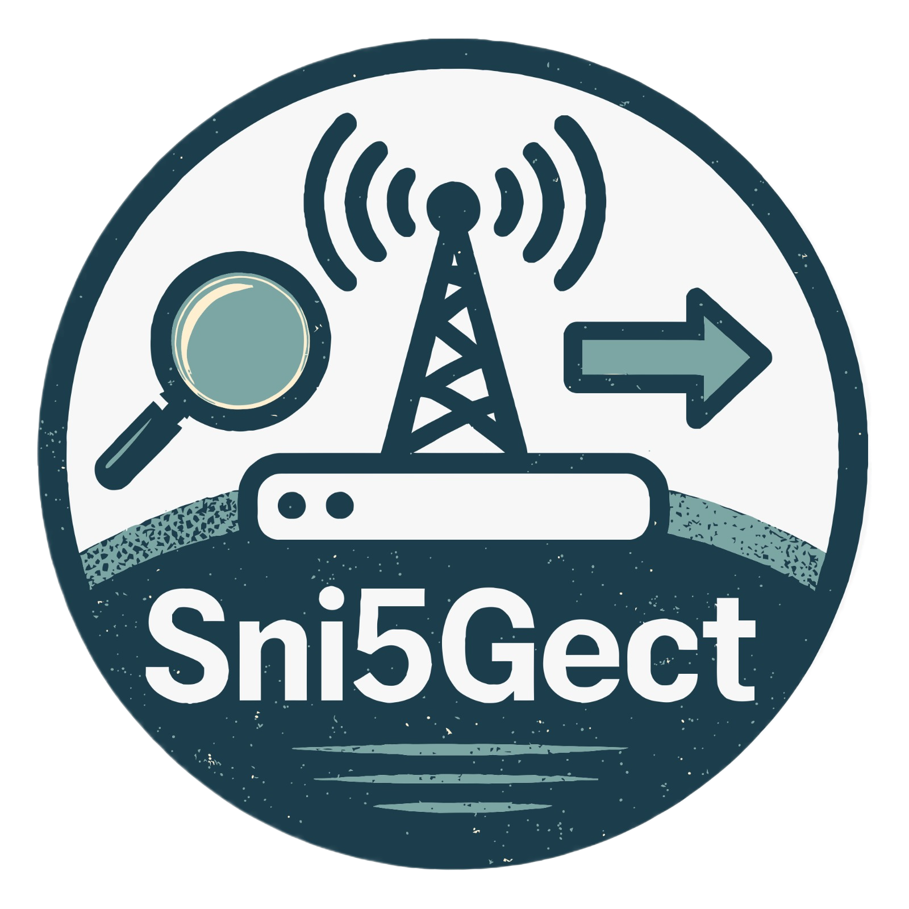

# Sni5Gect

> A framework for 5G NR Sniffing and Injection 

- DCI Sniffing
- Downlink/Uplink message sniffing
- Downlink message injection

[GitHub](https://github.com/asset-group/Sni5Gect-5GNR-sniffing-and-exploitation)
[Get Started](#sni5gect)
[Paper](_media/SNI5GECT__A_Practical_Approach_to_Inject_aNRchy_into_5G_NR.pdf)
[Artifacts](_media/USENIX_Security__25_Artifact_Appendix__SNI5GECT__A_Practical_Approach_to_Inject_aNRchy_into_5G_NR.pdf)
[Cite](/cite)